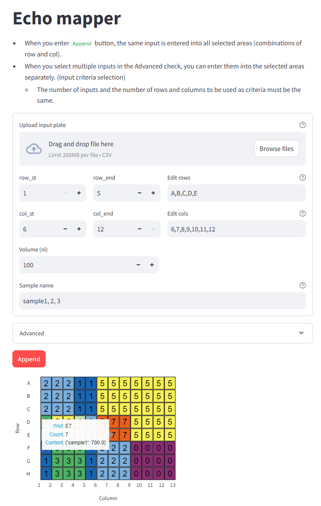

# echo_mapper

Mapping file generator for [Echo liquid handler](https://www.beckman.kr/liquid-handlers/echo-650-series)

## Installation

```bash
git clone https://github.com/sanekun/echo_mapper.git

python -m pip install -r requirements.txt

streamlit run echo_mapper.py
```

## Usage

- Select area with combinations of rows and columns.
- Append sample name and volume inti selected areas.
- Enable enter several samples into the selected areas seperately (advanced option).

